# Detection-of-Mule-Transactions
Project of DE471 Data Analytics and Business Intelligence

## Detail of Data
6 tables  including :

1. **DimAccount** : 150  rows , 9 columns
2. **DimChannel** : 3 rows , 3 columns
3. **DimCountry** : 6 rows , 5 columns
4. **DimCustomer** : 100 rows , 11 columns
5. **DimDate** : 365 rows , 8 columns
6. **FactTracsactions** : 1000 rows , 12 columns

## Overview
This banking dataset is a specialized collection of customer profiles and transactional logs designed to identify "mule" behaviors by highlighting contradictions between a user's reported status and their actual financial activity. It integrates demographic data, such as monthly income and occupation, with transactional behaviors, specifically monitoring the patterns of incoming and outgoing funds. Furthermore, it incorporates risk-based indicators such as AML scores for destination countries and temporal flags for weekend activity, allowing analysts to map out the "pass-through" patterns typical of money laundering. Essentially, this data source provides the multi-dimensional evidence needed to detect high-risk accounts that serve as temporary transit points for illicit funds.

## Problem Statement
Thailand is currently facing an unprecedented cybercrime crisis. According to reports from the Cyber Police and Whoscall, financial losses in 2024 alone have reached a staggering THB 60–80 billion. The primary engine driving this massive illicit economy is the rapid proliferation of mule accounts, which serve as the essential infrastructure for laundering stolen funds and concealing the identities of criminal syndicates.

The crisis is further exacerbated by a predatory shift in recruitment tactics. Criminal networks are increasingly targeting teenagers and vulnerable groups, enticing them with quick cash in exchange for opening bank accounts. This trend not only fuels the cycle of financial crime but also drags uninformed citizens into severe legal jeopardy. Without advanced data detection and real-time behavioral analysis, these accounts will continue to bypass traditional security measures, posing a critical threat to the integrity of the national banking system and the safety of public assets.

## Key Question
Key Questions:  
1. Which customers are most likely to be mule accounts?  
2. What transaction patterns indicate mule behavior ?
3. When do suspicious transactions occur most frequently ?
4. Which countries  are most associated with suspicious transactions?
5. Why do customers with low MonthlyIncome conduct high-value transactions?
6. How can transaction patterns be used to identify mule accounts?

## Data Dictionary

- **FactTransactions Table:** 
  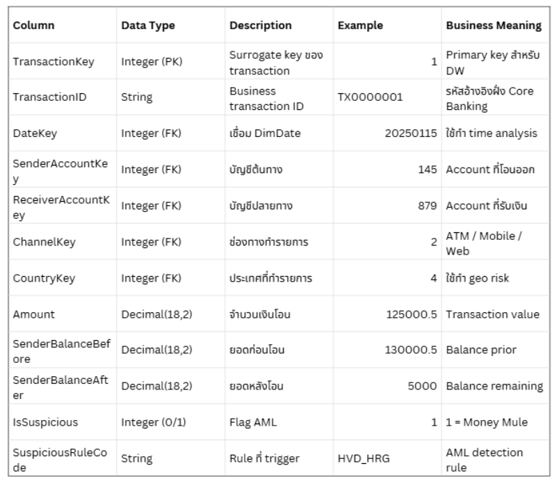

- **Date Table:** 
  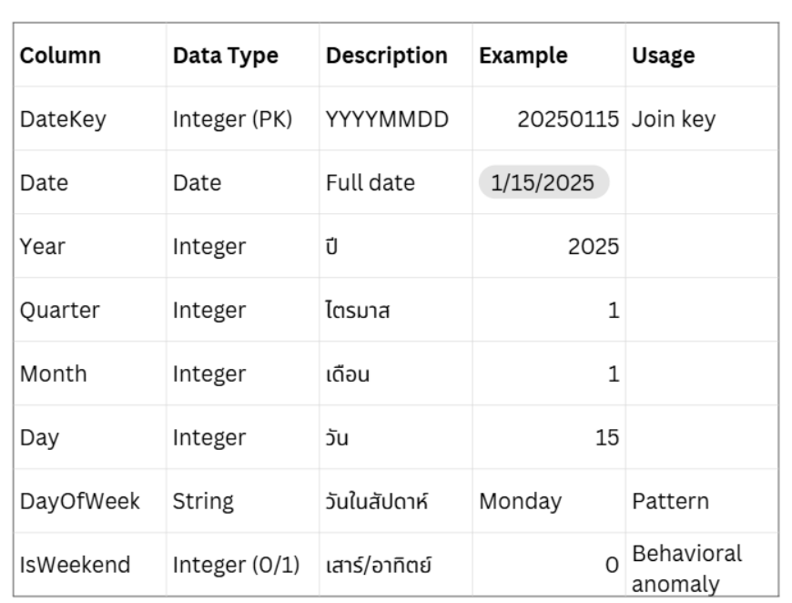

- **Customer:** 
  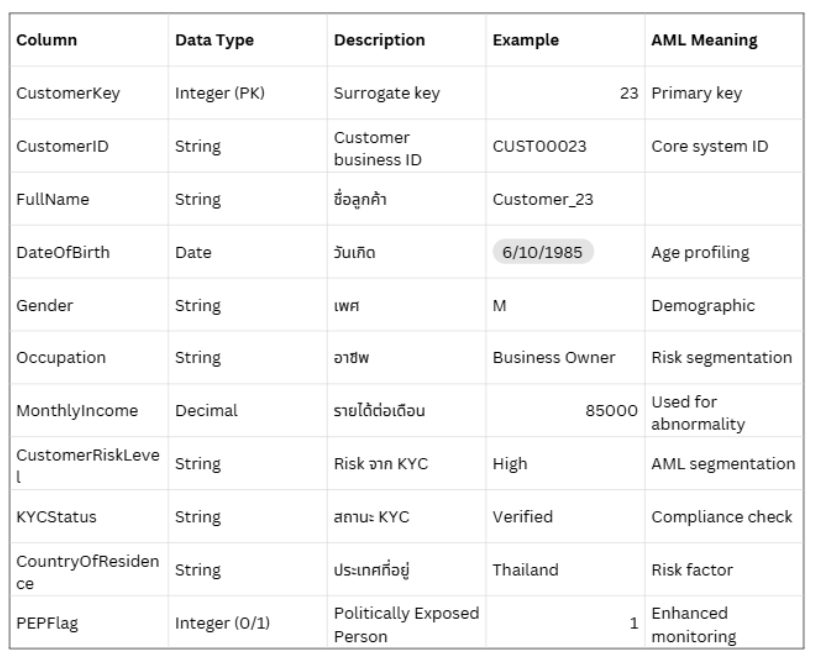

- **Country:** 
  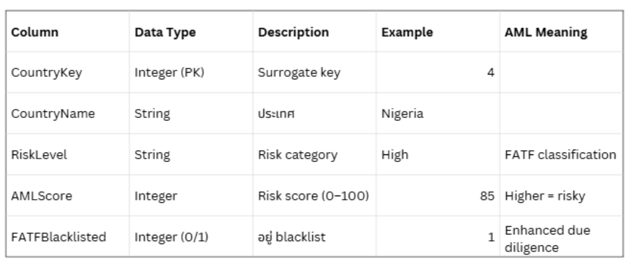

- **Channel:** 
  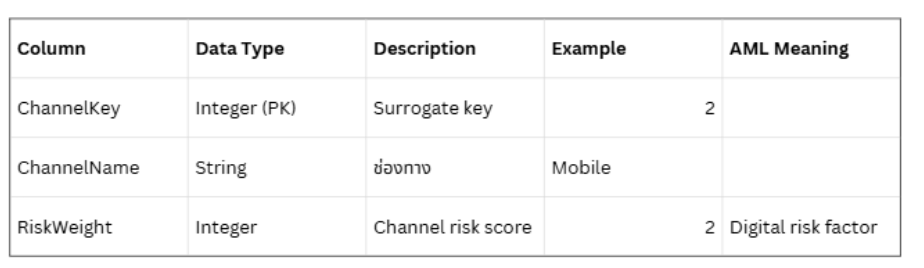

- **Account** 
  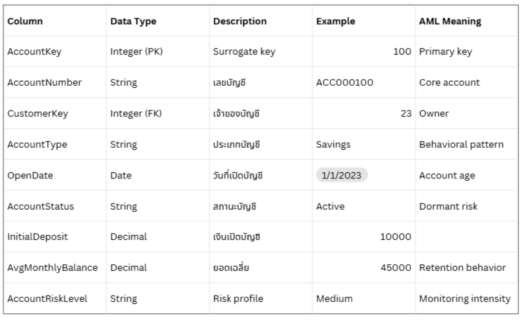

---

## Exploratory Data Analysis (EDA) & Analytical Actions
This phase focuses on understanding the data, uncovering patterns, and extracting actionable insights to differentiate between normal customer behavior and Money Mule accounts. The core analytical workflow includes:

* **Data Preparation & Cleansing:** Generated a cleansed, realistic dataset designed to support meaningful analysis. This involves removing null values, validating data types, and ensuring overall data accuracy.
* **Behavioral Pattern Analysis:** Performed exploratory analysis to discover data patterns, specifically comparing the transactional behaviors of mule vs. non-mule accounts.
* **Customer Segmentation:** Divided the dataset into smaller, targeted groups based on shared characteristics such as income, behavior, and location.
* **Hypothesis Testing:** Utilized quantifiable metrics and KPIs to rigorously test, validate, or refute assumptions regarding suspicious account activities.
* **Anomaly & Mule Pattern Detection:** Detected data points that deviate from standard customer behavior (Anomalies) and recognized specific signatures of "Money Mules." A key indicator monitored is **"Rapid Flow-through"** (funds moving in and out of an account rapidly).
* **Analytical Actions for Prevention:** Applied insights to establish a dual-strategy approach aimed at breaking the money mule cycle:
    * **Elimination:** Detecting and neutralizing active mule accounts using identified behavioral triggers.
    * **Prevention:** Proactively implementing measures to stop the creation of new mule accounts.

---
# Data Analysis & Key Finding

**1.Which customers are most likely to be mule accounts?**

Visualization : 

 Bar Chart : Show the number of mule transaction in each group  
 Line Chart : Show the percent of mule account in each group compare to themselves

  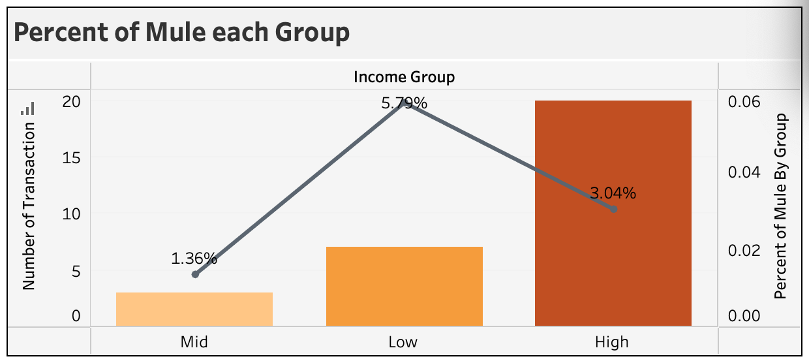

Key Finding : 
The High Income group has the largest number of detected mule accounts. However, in proportion, the Low Income group shows a higher mule account ratio. This means wealthy customers appear more in total count, but lower-income customers may face higher relative risk.

Key insight : 
Customers with lower Monthly Income may be more likely to be involved in suspicious transactions.

**2.What transaction patterns indicate mule behavior?**

Visualization : 
 Box plot : Show pattern to know that which account is likely to be mule 

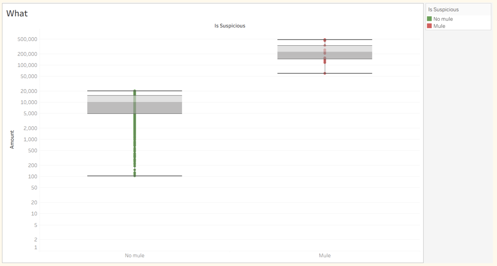

Key Finding : 
1. Median & Distribution
Mule Accounts (1): Higher median → larger transaction amounts.
Normal Accounts (0): Lower median → smaller, clustered amounts.
2. Variability
Group 1 has a wider spread, showing more volatile behavior.
3. Outliers
Both groups have outliers, but Group 1 reaches much higher values.

Key Insight : 
Transaction Amount is a key feature for identifying mule accounts.

**3.When do suspicious transactions occur most frequently ?**

Visualization : 
  Bar chart : Show the total transaction of mule account in each month   
  Line chart : Show the  total amount transaction in each month 

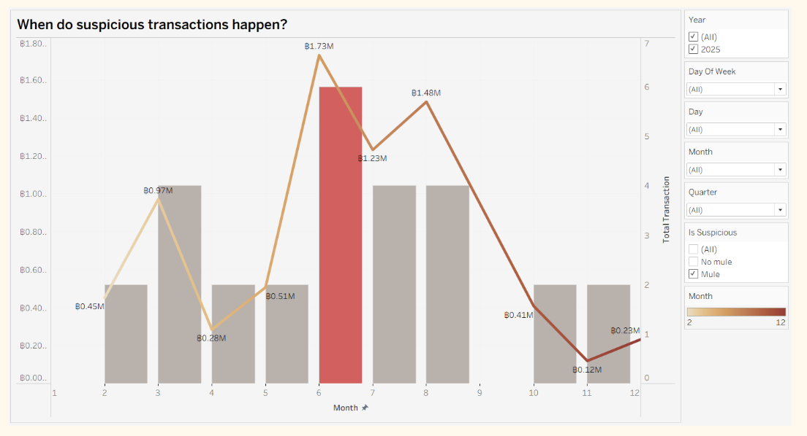

Key Finding : 
1. Suspicious Peak in June
Transactions sharply increased in June. Suggests unusual activity or fraud attempts during that period.
2. Upward Trend
From Jan–May, transactions remained stable at low to medium levels. Significant rise began after June.
3. High Volatility
Transaction values fluctuated heavily after June. Indicates irregular burst-like behavior rather than normal patterns.

Key insight : 
Sudden growth + high volatility are strong warning signs.  Continuous monitoring is needed to detect suspicious accounts early.

**4.Which countries are most associated with suspicious transactions?**

Visualization : 
  Bar chart : Show the total of  mule transaction 
  Text : Show the AML Risk Scores

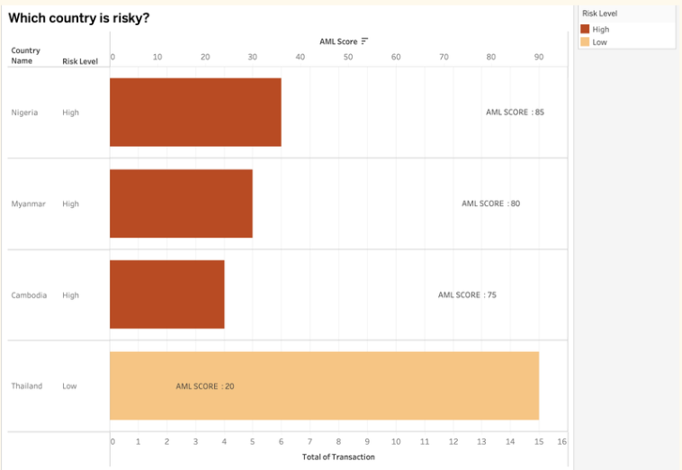

Key Finding : 
1. Countries with scores above 75, such as Nigeria and Myanmar, showed the highest concentration of mule-account behavior.  

Key Insight :  
AML Risk Scores show that Thailand has the highest link to mule accounts despite its low overall risk score

**5.Why do customers with low Monthly Income conduct high-value transactions?**

Visualization :  
  Scatter plot : Show the distribution of turn over  compare with income

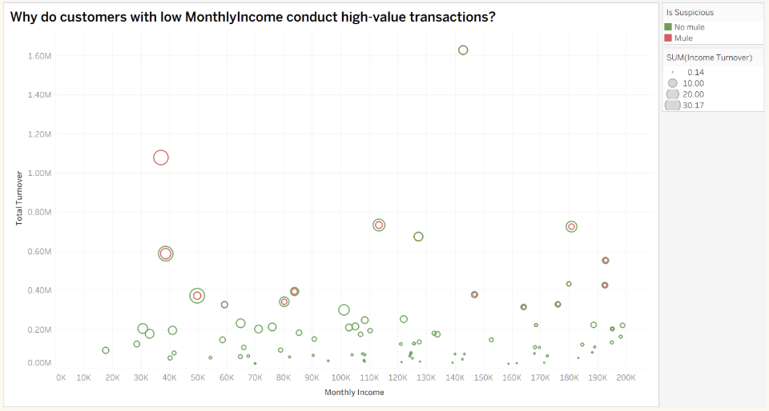

Key Finding :   
1. Customers earning below 50,000 THB with turnover above 200,000 THB show the highest mule-account risk.
2. Some cases reached extremely high turnover despite low income, a major red flag.

Key Insight :  
Lower income + unusually high transfers = highest suspicious risk.

**6.How can transaction patterns be used to identify mule accounts?**  
 
 Visualization :  
  Scatter plot : Show the behaviour of transaction in mule and no mule account

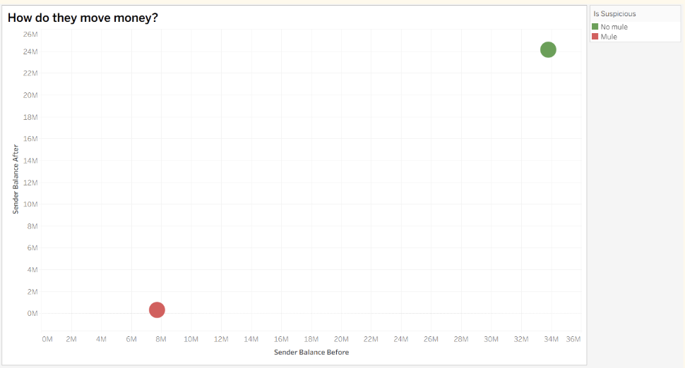

Key Finding :  
1. Data strongly points to Online Banking as the main channel used in suspicious activity.
2. It enables “Hit & Run” behavior — money is received and quickly transferred out (Account Draining).

Key Insight :  
This pattern differs clearly from normal customer behavior.

## Recommendations
1. **Behavioral-Based Detection** :  
Shift from static income checks to Behavioral Analytics by monitoring:  
**1.** High In-Out Velocity **2.** Rapid movement of funds **3.** Low ending balances
2. **Seasonal & Regional Calibration** :  
Apply Dynamic Thresholds during high-risk periods (June) and use a Thailand-specific risk rating.
3. **Predictive Outreach & Defense** :  
Launch targeted scam awareness campaigns for vulnerable groups and deploy real-time customer alerts.

## Impact
1. Improves detection of sophisticated mule accounts that stay below traditional risk thresholds.
2. Reduces gaps between official AML scores and real operational risk.
3. Prevents mule recruitment and reduces fraud losses through early intervention.
